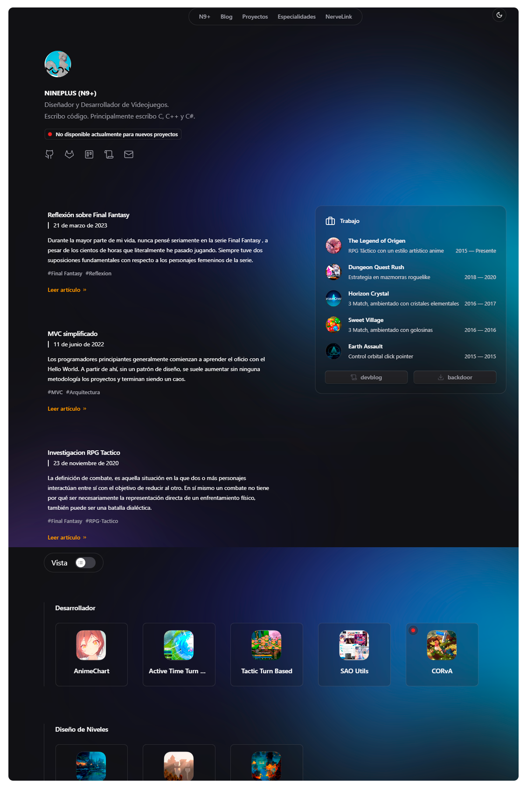

<div align="center">

```ocaml
NUNCA OMITIR / IGNORAR / EVITAR LEERME
```

</div>

<h1 align="center">
  <br>
    <a href="https://github.com/ninpl/perfil"></a>
      <br>
      Perfil
  <br>
</h1>

<p align="center">
  <a href="https://github.com/vercel/next.js/">
    
  </a>
  <a href="https://github.com/tailwindlabs/tailwindcss">
    
  </a>
  <a href="https://github.com/framer/motion">
    
  </a>
</p>

<pre align="center">
  <a href="#configuracion">CONFIGURACION</a> • <a href="#dependencias">DEPENDENCIAS</a> • <a href="#descargar">DESCARGAR</a> • <a href="#colaboradores">COLABORADORES</a> • <a href="#licencia">LICENCIA</a>
</pre>
<h1>
  <a href="#--------">
    
  </a>
</h1>

<p align="center">
  <sup>
      
      <sup>
            Español,
            <a href="./README.md">Ingles</a>,
            <a href="./README.md">Chino (中文)</a>
      </sup>
  </sup>
</p>


https://user-images.githubusercontent.com/7427480/228654230-233ae271-d6d8-4226-8353-5f11d9441ba2.mp4

<p align="center">
  <em>Video del layout general. Compruébalo en <a href="https://github.com/ninpl/perfil">xx.doc</a>.</em>
</p>

## :octocat: ‎ <sup><sub><samp>¡HOLA! ¡GRACIAS POR VENIR!</samp></sub></sup>


     
- **Index** : Pagina principal de la web
- **Proyectos** : Proyectos de codigo abierto (github) y oficiales
- **Especialidades** : Pagina donde se muestran las especialidades con vinculo
- **Tema Claro/Oscuro** : Tema para blanco y negro
- **Github Pinned** : Indexacion de los repositorios pinned en github
- **Articulos** : 3 primeros articulos que se muestran al inicio
- **Disponibilidad** : Estado de disponibilidad para trabajos

Esta web esta creada con la tecnologia Next.js (Node.js), Tailwind y Framer Motion.

Tiene algunos errores que no he podido arreglar al momento de crear los archivos estaticos, las rutas se rompen por lo que en la
postcompilacion he tenido que cambiar algunos links manualmente para lograr que funciones, no soy muy asiduo de esta tecnologia.

Si tienes errores (que los tendras), puedes mirar este issue https://github.com/vercel/next.js/discussions/32217

<div align="center">

```ocaml
CLIC O TOQUE ❲☰❳ PARA VER EL ESPEJO
```

</div>
<p align="right">
  [<a href="https://gitlab.com/ninpl/perfil.git">espejo</a>]
</p>

## <samp>Configuracion</samp>

```
git clone https://github.com/ninpl/perfil.git
```
```powershell
npm install
```
Renombrar `ejemplo.env` a `.env` y modificar las variables:
```
SITE_URL=
NEXT_PUBLIC_SITE_URL=
GITHUB_ACCESS_TOKEN=
GITHUB_USERNAME=
```
```powershell
npm run dev
```
Comprobar `http://localhost:3000`
```powershell
npm run build && npm run export
```

## <samp>Dependencias</samp>

| Nombre        | Version                         | Licencia |
|:--------------|:--------------------------------|:------------------------------|
| [Next.js](https://nextjs.org/) | 13.2.3 | [MIT](https://github.com/vercel/next.js/blob/canary/license.md)  |
| [Tailwind](https://tailwindcss.com/) | 3.2.7 | [MIT](https://github.com/tailwindlabs/tailwindcss/blob/master/LICENSE.md)  |
| [Framer Motion](https://www.framer.com/motion/) | 10.2.3 | [MIT](https://github.com/framer/motion/blob/main/LICENSE.md)  |
  
## <samp>Descargar</samp>

Puede [descargar](https://github.com/ninpl/perfil/releases) la última versión de **mi perfil**. 
  
## <samp>Colaboradores</samp>

1. ¡Bifurcalo!
2. Crea tu rama de características: `git checkout -b nueva-funcion`
3. Confirme sus cambios: `git commit -am 'Agregar funcionalidad'`
4. Empuje la rama: `git push origin nueva-funcion`
5. Envíe una pull request: D

El proyecto esta mantenido por [N9+](https://github.com/ninpl) con ayuda de los colaboradores ([lista](https://github.com/ninpl/perfil/graphs/contributors)).

<a href="https://github.com/ninpl/perfil/graphs/contributors">
  
</a>

## <samp>Agradecimientos</samp>

|           |   | Inspiración y Recursos     |         |    Licencia        |
|:---------:|:-:|:-------------------------------|:--------------------|:----------:|
|  Ayuda | 1 | [Miguel Ángel](https://github.com/midudev)  |   |   |
|  Inspiración | 2 | [Edu Calvo](https://github.com/educlopez)  |   |   |
|  contributors-img  | 3 | [Suguru Inatomi](https://github.com/lacolaco)         |   | Sin Licencia |
|  Shields  | 4 | [Thaddée Tyl](https://github.com/espadrine)    |   | [CC0 LICENSE](https://github.com/badges/shields/blob/master/LICENSE) |


## <samp>Licencia</samp>

<pre align="center">
  <a href="https://es.wikipedia.org/wiki/Licencia_de_c%C3%B3digo_abierto">Libre</a> • <a href="https://ninpl.com">ninpl.com</a> • <a href="https://github.com/ninpl">@ninpl</a>
</pre>

<pre align="center">
  <a href="#readme">VOLVER ARRIBA</a>
</pre>
